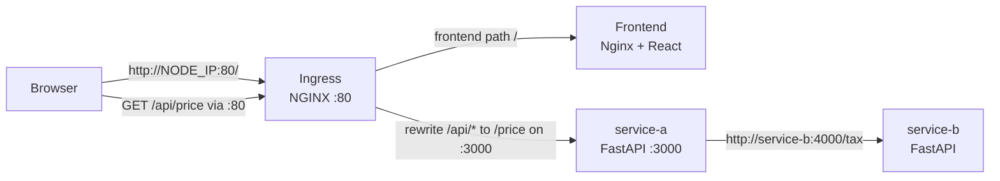
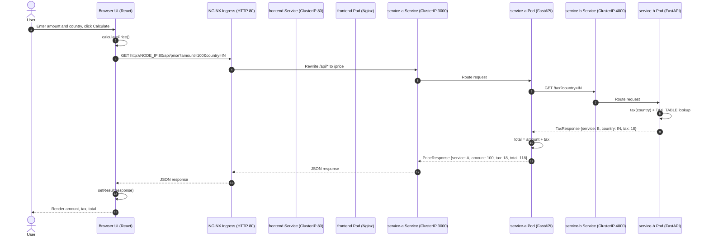

# Microservices Kubernetes Deployment (Minikube)

This project deploys three services on Kubernetes:
- service-b: internal tax lookup API
- service-a: public price API that calls service-b
- tax-calculator-frontend: React/Vite frontend served by Nginx

Ingress is used as the public entry point:
- Public ingress URL listens on HTTP port `80`
- /api/(.*) routes to service-a port `3000` and rewrites to /$1
- /(.*) routes to frontend service port `80`

## Architecture

Request flow:
1. Browser opens frontend using ingress URL: `http://<NODE_IP>:80/`.
2. Frontend calls service-a through ingress path `/api/price` on port `80`.
3. Ingress rewrites `/api/price` to `/price` and forwards to service-a on port `3000`.
4. service-a calls service-b using Kubernetes DNS (`http://service-b:4000`).




## Service Communication And Final Output Flow

This is the end-to-end lifecycle of one tax calculation request.

### Method Calls And Response Returns

1. Frontend method call:
   - User clicks Calculate in UI.
   - React method `calculatePrice()` in `tax-calculator-frontend/src/App.jsx` runs.
   - It calls:
     - `fetch("${API_URL}/price?amount=${amount}&country=${country}")`
   - In ingress mode, `API_URL` should be `/api`.
   - It parses response:
     - `const data = await res.json()`
   - It stores final response object:
     - `setResult(data)`

2. service-a method call:
   - FastAPI route `price(amount: float, country: str)` in `services/service-a/main.py` runs.
   - It normalizes country:
     - `country = country.upper()`
   - It calls service-b:
     - `client.get(f"{TAX_SERVICE_URL}/tax", params={"country": country})`
   - It reads tax response JSON and computes:
     - `tax = float(j.get("tax", 0))`
     - `total = amount + tax`
   - It returns final JSON:
     - `{ service, amount, tax, total, container, service_b_container }`

3. service-b method call:
   - FastAPI route `tax(country: str)` in `services/service-b/main.py` runs.
   - It normalizes country and resolves tax from `TAX_TABLE`.
   - It returns JSON:
     - `{ service, country, tax, container }`

### UML Sequence Diagram (Request To Final Output)



1. User opens the frontend URL: `http://<NODE_IP>:80/`.
2. Kubernetes ingress routes `/(.*)` to `frontend` service on port `80`.
3. Nginx serves the built React app.
4. In the browser, the app sends an API call to service-a using `VITE_API_URL=/api`:
  - `GET http://<NODE_IP>:80/api/price?amount=<amount>&country=<country>`
5. Ingress matches `/api/(.*)` and rewrites path to `/$1`.
6. Kubernetes `service-a` ClusterIP service forwards request to one service-a pod (`3000`).
7. service-a receives `amount` and `country`, then calls service-b through cluster DNS:
   - `GET http://service-b:4000/tax?country=<country>`
8. Kubernetes `service-b` ClusterIP service forwards to one service-b pod (`4000`).
9. service-b looks up tax from its in-memory table and returns JSON (for example, `IN -> 18`).
10. service-a calculates final total:

$$
total = amount + tax
$$

11. service-a returns the final payload to the browser, including both container names for traceability.
12. Frontend renders amount, tax, and total as the final output seen by the user.


### Worked Example

Request from frontend to ingress:

```http
GET /api/price?amount=100&country=IN
# Host: <NODE_IP>:80
```

Internal forwarded request from ingress to service-a (after rewrite):

```http
GET /price?amount=100&country=IN
```

Internal request from service-a to service-b:

```http
GET /tax?country=IN
```

service-b response (example):

```json
{
  "service": "B",
  "country": "IN",
  "tax": 18,
  "container": "service-b-5b9b9c9855-67k76"
}
```

service-a final response (example):

```json
{
  "service": "A",
  "amount": 100.0,
  "tax": 18.0,
  "total": 118.0,
  "container": "service-a-556ccd9bbc-fqg9r",
  "service_b_container": "service-b-5b9b9c9855-67k76"
}
```

## Repository Structure

```text
k8s/
  frontend.yaml
  ingress.yaml
  service-a.yaml
  service-b.yaml
services/
  service-a/
  service-b/
tax-calculator-frontend/
```

## Service And Config Details

### service-b (internal tax service)
- Code: `services/service-b/main.py`
- Endpoint: `GET /tax?country=<CODE>`
- Port: `4000`
- Kubernetes service type: `ClusterIP` (internal only)
- Tax table:
  - `IN -> 18`
  - `US -> 8`
  - `EU -> 20`
  - default -> `10`
- Deployment config (`k8s/service-b.yaml`):
  - Replicas: `2`
  - Resources:
    - Requests: `cpu 100m`, `memory 64Mi`
    - Limits: `cpu 250m`, `memory 128Mi`
  - Probes:
    - Readiness: `GET /tax?country=IN`
    - Liveness: `GET /tax?country=IN`

### service-a (price aggregator)
- Code: `services/service-a/main.py`
- Endpoint: `GET /price?amount=<number>&country=<CODE>`
- Port: `3000`
- Kubernetes service type: `ClusterIP` (exposed publicly via ingress)
- Environment variables:
  - `TAX_SERVICE_URL=http://service-b:4000`
  - `FRONTEND_URL=*`
- Behavior:
  - Calls `service-b` for tax.
  - Returns amount, tax, total, and container names for both services.
- Deployment config (`k8s/service-a.yaml`):
  - Replicas: `2`
  - Resources:
    - Requests: `cpu 100m`, `memory 64Mi`
    - Limits: `cpu 250m`, `memory 128Mi`
  - Probes:
    - Readiness: `GET /price?amount=100&country=IN`
    - Liveness: `GET /price?amount=100&country=IN`

### Frontend (React/Vite + Nginx)
- App source: `tax-calculator-frontend/`
- Build arg: `VITE_API_URL`
- Runtime: Nginx on port `80`
- Kubernetes service type: `ClusterIP` (exposed publicly via ingress)
- Important:
  - `VITE_API_URL` is baked into the bundle at image build time.
  - For ingress, build with `VITE_API_URL=/api`.
- Deployment config (`k8s/frontend.yaml`):
  - Replicas: `2`
  - Resources:
    - Requests: `cpu 50m`, `memory 32Mi`
    - Limits: `cpu 100m`, `memory 64Mi`
  - Probes:
    - Readiness: `GET /`
    - Liveness: `GET /`

### Ingress (public entry)
- Config: `k8s/ingress.yaml`
- Ingress class: `nginx`
- Public entry port: `80` (HTTP)
- API path: `/api/(.*)`
- Frontend path: `/(.*)`
- Backend route ports:
  - `/api/(.*)` -> service-a port `3000`
  - `/(.*)` -> frontend service port `80`
- Rewrite annotation:
  - `nginx.ingress.kubernetes.io/rewrite-target: /$1`

## Prerequisites

- Docker
- Minikube
- kubectl

## Deployment Steps

### 1) Build backend docker containers

```bash
cd microservices-k8s-deploy

docker build --no-cache -t service-b:latest services/service-b
docker build --no-cache -t service-a:latest services/service-a
docker build --no-cache \
  --build-arg VITE_API_URL=/api \
  -t tax-calculator-frontend:latest \
  tax-calculator-frontend
```

### 2) Check Minikube is running and enable ingress

```bash
minikube version
minikube start
minikube status
```

Expected status:

```text
type: Control Plane
host: Running
kubelet: Running
apiserver: Running
kubeconfig: Configured
docker-env: in-use
```

__Enable ingress__

```bash

minikube addons enable ingress
kubectl get pods -n ingress-nginx
```

__Check if ingress addon is enabled:__


```bash
$ minikube addons list | grep ingress
│ ingress                     │ minikube │ enabled ✅ │ Kubernetes                             │
│ ingress-dns                 │ minikube │ disabled   │ minikube                               │
```

### 3) Load all images into Minikube

```bash
minikube image load service-b:latest
minikube image load service-a:latest
minikube image load --overwrite=true tax-calculator-frontend:latest
```

### 4) Apply Kubernetes manifests

```bash
kubectl apply -f k8s/
```

Expected output:

```text
deployment.apps/frontend created
service/frontend created
deployment.apps/service-a created
service/service-a created
deployment.apps/service-b created
service/service-b created
ingress.networking.k8s.io/microservices-ingress created
```

### 5) Verify pods, services, and ingress

```bash
kubectl get deployments,svc,ingress,pods
```

Example output:

```text
NAME                        READY   UP-TO-DATE   AVAILABLE   AGE
deployment.apps/frontend    2/2     2            2           24h
deployment.apps/service-a   2/2     2            2           24h
deployment.apps/service-b   2/2     2            2           24h

NAME                 TYPE        CLUSTER-IP      EXTERNAL-IP   PORT(S)    AGE
service/frontend     ClusterIP   10.106.129.45   <none>        80/TCP     24h
service/kubernetes   ClusterIP   10.96.0.1       <none>        443/TCP    5d23h
service/service-a    ClusterIP   10.103.59.5     <none>        3000/TCP   24h
service/service-b    ClusterIP   10.103.52.202   <none>        4000/TCP   24h

NAME                                              CLASS   HOSTS   ADDRESS        PORTS   AGE
ingress.networking.k8s.io/microservices-ingress   nginx   *       192.168.49.2   80      40m

NAME                             READY   STATUS    RESTARTS      AGE
pod/frontend-d4856fd5c-wk7p6     1/1     Running   0             25m
pod/frontend-d4856fd5c-xj26j     1/1     Running   0             25m
pod/service-a-556ccd9bbc-9vlfk   1/1     Running   1 (43m ago)   24h
pod/service-a-556ccd9bbc-fqg9r   1/1     Running   1 (43m ago)   24h
pod/service-b-5b9b9c9855-5qw29   1/1     Running   1 (43m ago)   24h
```

### 6) Watch pod readiness live

```bash
kubectl get pods -w
```

Example output:

```text
NAME                         READY   STATUS    RESTARTS   AGE
frontend-58b487d4b8-sh9sw    1/1     Running   0          78s
frontend-58b487d4b8-xkkn4    1/1     Running   0          78s
service-a-556ccd9bbc-9vlfk   1/1     Running   0          78s
service-a-556ccd9bbc-fqg9r   1/1     Running   0          78s
service-b-5b9b9c9855-5qw29   1/1     Running   0          78s
service-b-5b9b9c9855-67k76   1/1     Running   0          78s
```

### 7) Rollout status

```bash
kubectl rollout status deployment/service-b
kubectl rollout status deployment/service-a
kubectl rollout status deployment/frontend
kubectl rollout status deployment/ingress-nginx-controller -n ingress-nginx
```

Expected output:

```text
deployment "service-b" successfully rolled out
deployment "service-a" successfully rolled out
deployment "frontend" successfully rolled out
deployment "ingress-nginx-controller" successfully rolled out
```

## Smoke Test

```bash
minikube ip
# Example: 192.168.49.2

curl "http://$(minikube ip):80/api/price?amount=100&country=IN"
```

### Example response:

```json
{
  "service":"A",
  "amount":100.0,
  "tax":18.0,"total":118.0,
  "container":"service-a-556ccd9bbc-fqg9r",
  "service_b_container":"service-b-5b9b9c9855-67k76"
}
```


### check which container runiing/giving responses:

- `"container":"service-a-556ccd9bbc-fqg9r"`
- `"service_b_container":"service-b-5b9b9c9855-67k76"`

```bash
$ kubectl get pods
NAME                         READY   STATUS    RESTARTS   AGE
frontend-58b487d4b8-sh9sw    1/1     Running   0          7h43m
frontend-58b487d4b8-xkkn4    1/1     Running   0          7h43m

service-a-556ccd9bbc-9vlfk   1/1     Running   0          7h43m
service-a-556ccd9bbc-fqg9r   1/1     Running   0          7h43m
service-b-5b9b9c9855-5qw29   1/1     Running   0          7h43m
service-b-5b9b9c9855-67k76   1/1     Running   0          7h43m
```

Browser URL:
- Frontend: `http://$(minikube ip):80/`
- API: `http://$(minikube ip):80/api/price?amount=100&country=IN`

### Load frontend on browser:


---------------------------------------------------------------------------------------------------------------------------------------
## Debugging

### Inspect pod details

```bash
kubectl describe pod POD_NAME
```

### Check logs

```bash
kubectl logs POD_NAME --tail=100
kubectl logs POD_NAME --previous --tail=100
```

### Check ingress controller and ingress

```bash
kubectl get pods -n ingress-nginx
kubectl describe ingress microservices-ingress
```

### Check recent cluster events

```bash
kubectl get events --sort-by=.metadata.creationTimestamp
```

### Example: describe one service-a pod

```bash
kubectl describe pod service-a-556ccd9bbc-9vlfk
```

Sample important sections:
- Image: `service-a:latest`
- Env:
  - `TAX_SERVICE_URL=http://service-b:4000`
  - `FRONTEND_URL=*`
- Probes:
  - Readiness: `GET /price?amount=100&country=IN`
  - Liveness: `GET /price?amount=100&country=IN`
- Example transient warning during startup:
  - `Readiness probe failed: HTTP probe failed with statuscode: 500`

A short readiness probe warning can be normal during startup if the app depends on another service that is not ready yet.

## Common Notes

- If frontend cannot call service-a in ingress mode, rebuild frontend image with `VITE_API_URL=/api`:

```bash
docker build --no-cache \
  --build-arg VITE_API_URL=/api \
  -t tax-calculator-frontend:latest \
  tax-calculator-frontend
minikube image load --overwrite=true tax-calculator-frontend:latest
kubectl rollout restart deployment/frontend
```

- `service-b` is internal only (`ClusterIP`), so test it through service-a or from inside the cluster.
- Ingress rewrites `/api/(.*)` to `/$1` before forwarding to service-a.
- These manifests use `imagePullPolicy: IfNotPresent`, which is correct for locally built images loaded into Minikube.

### frontend:

```bash
kubectl rollout status deployment/frontend
kubectl get pods
kubectl get svc frontend
kubectl get ingress
```
